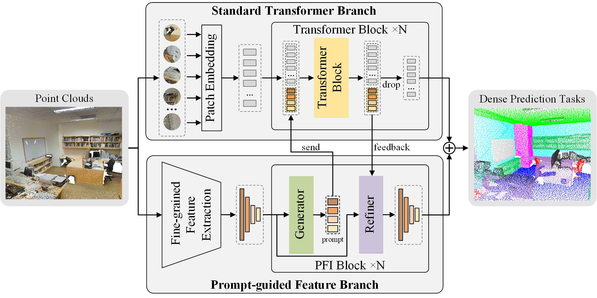
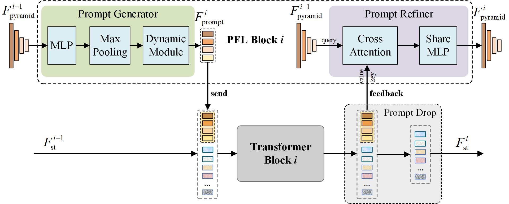

# PCT-Prompt

**PCT-Prompt**, a novel framework for dense prediction tasks in point clouds, introduces a prompt-guided Transformer framework that enhances the adaptability of standard Transformers for complex 3D tasks.



## Overview

PCT-Prompt addresses the following challenges in point cloud dense prediction:

1. **Weak prior assumptions** in standard Transformers, limiting their effectiveness.
2. **Balancing local details and global consistency** in multi-scale geometric features.

The framework integrates:



- **Fine-grained Feature Extraction (FFE) Module**: Captures multi-scale geometric features using Geometric Set Abstraction (GSA) and PnP-3D blocks.
- **Prompt-Refined Feature Learning (PFL) Module**: Generates and refines prompt tokens via cross-attention mechanisms and a novel prompt drop mechanism.
- **Transformer Backbone**: A pre-trained standard Transformer is extended with a prompt-guided feature branch for enhanced adaptability.

## Features

- A novel **prompt-guided feature branch** that extends standard Transformers.
- Modular design compatible with multiple pre-trained weights.
- Significant performance improvements in **dense prediction tasks** such as 3D segmentation.

## Prerequisites

This framework is implemented and tested under the following environment:

- Python 3.6+
- PyTorch (torch==1.7.0)
- NVIDIA GPU + CUDA
- numpy
- pointnet2_ops_lib

Compile the necessary PointNet++ operations using the following commands:

```bash
cd modules/pointnet2_ops_lib
python setup.py install
cd ../../
```

## Data preparation

Please follow the instructions given in  [Point-Bert](https://github.com/Julie-tang00/Point-BERT) ,Finally the directory structure should like this:

```
PCT-Prompt
├─cfgs
├─sem_segmentation_DALES
    ├─meta 
    ├─model
    ├─moduels
    ├─util
    ├─utils
├─utils
├── README.md
```

## Training

By default, one ```checkpoints``` directory will be created automatically. The  checkpoints will be saved in this directory.

```
python train_main.py
```

You can specify the path for saving checkpoints and resume training in the `utils/parser.py` file. Additionally, you can define different model hyperparameters in the `cfgs` directory.
